# System Architecture

```mermaid
graph TB
    subgraph HOST["🖥️ Host (localhost)"]
        USER(("👤 User"))
    end

    subgraph COMPOSE["Docker Compose · ai-workbench"]
        subgraph CORE["Platform Core (always on)"]
            CADDY["🚪 Caddy<br/>:8090 / :80<br/><i>reverse proxy · catalog · status</i>"]
            LITELLM["⚡ LiteLLM<br/>:4000<br/><i>model gateway</i>"]
            LITELLM_DB["🐘 Postgres<br/>:5432<br/><i>LiteLLM state</i>"]
            PHOENIX["🔭 Phoenix<br/>:6006<br/><i>OTEL tracing</i>"]
            CHROMA["🔍 Chroma<br/><i>vector store</i>"]
        end

        subgraph UI["UI Layer (always on)"]
            OPENWEBUI["💬 Open WebUI<br/>:3000 · chat.localhost<br/><i>chat frontend</i>"]
        end

        subgraph NOTEBOOK_PROFILE["Open Notebook (profile: notebook)"]
            NOTEBOOK["📓 Open Notebook<br/>:8502 · notebook.localhost<br/><i>research UI</i>"]
            SURREAL["🗄️ SurrealDB<br/><i>notebook persistence</i>"]
        end

        subgraph DATA_SERVERS["MCP Data Servers (profile: tools)"]
            LDAP_MCP["📂 ldap-mcp<br/><i>AD directory queries</i>"]
            SNOW_MCP["📋 servicenow-mcp<br/><i>ITSM data queries</i>"]
            MAGIC["✨ magic-fetch<br/><i>demand-signal collector</i>"]
        end

        subgraph AGENTS["MCP Agents (profile: tools)"]
            CODE_AGENT["🤖 code-agent<br/><i>Python execution via sandbox</i>"]
            LDAP_AGENT["🤖 ldap-agent<br/><i>org hierarchy queries</i>"]
            SNOW_AGENT["🤖 servicenow-agent<br/><i>ITSM analysis</i>"]
            ENRICH_AGENT["🤖 enrichment-agent<br/><i>cross-source orchestrator</i>"]
        end

        subgraph SANDBOX["Compute Layer (profile: tools)"]
            CODE_SANDBOX["📦 Open Terminal<br/><i>sandboxed Python runtime</i>"]
            MCPO["🔌 mcpo<br/><i>MCP → OpenAPI proxy</i>"]
        end
    end

    subgraph EXTERNAL["External APIs"]
        OPENAI["OpenAI API"]
        ANTHROPIC["Anthropic API"]
        AZURE["Azure OpenAI"]
        LDAP_SERVER["AD LDAP<br/><i>LDAPS :636</i>"]
        SNOW_API["ServiceNow<br/><i>REST API</i>"]
    end

    %% User → Host ports
    USER -- ":3000" --> OPENWEBUI
    USER -- ":8090 /catalog" --> CADDY
    USER -- ":8090 /mcp/*" --> CADDY
    USER -. ":8502 (optional)" .-> NOTEBOOK

    %% Open WebUI → platform
    OPENWEBUI -- "chat · embeddings" --> LITELLM
    OPENWEBUI -- "RAG vectors" --> CHROMA
    OPENWEBUI -- "MCP tool calls" --> CADDY

    %% Caddy → MCP tools (slug-based routing)
    CADDY -- "/mcp/code-agent/*" --> CODE_AGENT
    CADDY -- "/mcp/ldap-agent/*" --> LDAP_AGENT
    CADDY -- "/mcp/ldap-mcp/*" --> LDAP_MCP
    CADDY -- "/mcp/servicenow-agent/*" --> SNOW_AGENT
    CADDY -- "/mcp/servicenow-mcp/*" --> SNOW_MCP
    CADDY -- "/mcp/enrichment-agent/*" --> ENRICH_AGENT
    CADDY -- "/mcp/magic-fetch/*" --> MAGIC

    %% Agents → LiteLLM (reasoning)
    CODE_AGENT -- "reasoning" --> LITELLM
    LDAP_AGENT -- "reasoning" --> LITELLM
    SNOW_AGENT -- "reasoning" --> LITELLM
    ENRICH_AGENT -- "reasoning" --> LITELLM

    %% Agents → data servers / sandbox
    LDAP_AGENT -- "data" --> LDAP_MCP
    SNOW_AGENT -- "data" --> SNOW_MCP
    CODE_AGENT -- "execute" --> CODE_SANDBOX
    ENRICH_AGENT -- "execute" --> CODE_SANDBOX
    ENRICH_AGENT -. "delegates" .-> LDAP_AGENT
    ENRICH_AGENT -. "delegates" .-> SNOW_AGENT

    %% Sandbox → mcpo → data servers (code-driven path)
    CODE_SANDBOX -- "REST" --> MCPO
    MCPO -- "MCP" --> LDAP_MCP
    MCPO -- "MCP" --> SNOW_MCP

    %% Platform internals
    LITELLM --> LITELLM_DB
    NOTEBOOK -- "chat" --> LITELLM
    NOTEBOOK -- "persistence" --> SURREAL

    %% External
    LITELLM --> OPENAI
    LITELLM --> ANTHROPIC
    LITELLM --> AZURE
    LDAP_MCP -- "LDAPS" --> LDAP_SERVER
    SNOW_MCP -- "REST" --> SNOW_API

    %% OTEL (simplified — all instrumented services → Phoenix)
    OPENWEBUI -. "OTEL" .-> PHOENIX
    LITELLM -. "OTEL" .-> PHOENIX
    CODE_AGENT -. "OTEL" .-> PHOENIX
    LDAP_AGENT -. "OTEL" .-> PHOENIX
    SNOW_AGENT -. "OTEL" .-> PHOENIX
    ENRICH_AGENT -. "OTEL" .-> PHOENIX
    MAGIC -. "OTEL" .-> PHOENIX

    style CORE fill:#1a1a2e,color:#fff
    style UI fill:#16213e,color:#fff
    style NOTEBOOK_PROFILE fill:#16213e,color:#fff,stroke-dasharray: 5 5
    style DATA_SERVERS fill:#0f3460,color:#fff
    style AGENTS fill:#0f3460,color:#fff
    style SANDBOX fill:#0f3460,color:#fff
    style EXTERNAL fill:#533483,color:#fff
    style HOST fill:#e94560,color:#fff
```

## Data flow summary

- **User → Open WebUI → Caddy → MCP tools** — slug-based routing (`/mcp/<slug>/*`)
- **Agents → LiteLLM** — reasoning via ReAct loops
- **Agents → data servers** — `ldap-agent` → `ldap-mcp`, `servicenow-agent` → `servicenow-mcp`
- **Agents → Open Terminal** — `code-agent` and `enrichment-agent` execute Python
- **Open Terminal → mcpo → data servers** — generated Python calls enterprise APIs via REST (deterministic, no LLM in loop)
- **enrichment-agent → specialist agents** — delegates data gathering to `ldap-agent` and `servicenow-agent`
- **LiteLLM → external APIs** — OpenAI, Anthropic, Azure
- **Everything → Phoenix** — OTEL traces for observability

## Service inventory

| Service | Profile | Role | Endpoint |
|---------|---------|------|----------|
| Caddy | core | Reverse proxy, catalog, status dashboard | `:8090`, `ai-workbench.localhost` |
| LiteLLM | core | Model gateway / router | `:4000`, `litellm.localhost` |
| Postgres | core | LiteLLM state | `:5432` |
| Phoenix | core | OTEL trace collector | `phoenix.localhost` |
| Chroma | core | Vector DB for RAG | internal only |
| Open WebUI | core | Chat frontend | `:3000`, `chat.localhost` |
| Open Notebook | notebook | Research UI | `:8502`, `notebook.localhost` |
| SurrealDB | notebook | Notebook persistence | internal only |
| ldap-mcp | tools | AD directory data server | `/mcp/ldap-mcp` |
| servicenow-mcp | tools | ServiceNow data server | `/mcp/servicenow-mcp` |
| magic-fetch | tools | Demand-signal collector | `/mcp/magic-fetch` |
| ldap-agent | tools | Org hierarchy agent | `/mcp/ldap-agent` |
| servicenow-agent | tools | ITSM analysis agent | `/mcp/servicenow-agent` |
| code-agent | tools | Python execution agent | `/mcp/code-agent` |
| enrichment-agent | tools | Cross-source orchestrator | `/mcp/enrichment-agent` |
| Open Terminal | tools | Sandboxed Python runtime (replaces code-sandbox) | internal only |
| mcpo | tools | MCP → OpenAPI proxy (tool gateway) | `/mcpo/*` (docs), internal `mcpo:8000` |
