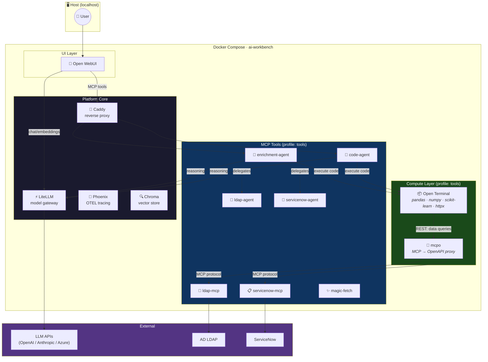

# File Processing Pipeline — Design Document

> Status: **Phase 1 implemented** · April 2026

## Problem Statement

The workbench can chat with enterprise data (LDAP, ServiceNow) through MCP
agents, and it can execute Python code in a sandbox. But there is a gap when a
user uploads a data file (e.g. a CSV roster) and wants the system to **process
it with code** that also calls enterprise data sources:

```
User uploads CSV
      ↓
Open WebUI routes it through RAG (embeddings → Chroma)
      ↓
LLM sees RAG snippets, calls enrich_data(task="...")
      ↓
Enrichment agent receives a text string — no file content
      ↓
❌ Agent cannot process data it never received
```

The user's requirement is clear: **"it should be writing code."** The file
should reach a Python sandbox where `pd.read_csv()` handles it, then code
drives LDAP/ServiceNow queries, joins results, and exports Excel. The LLM's
job is to *write the code*, not to extract data from its context.

## Current Architecture (what works today)

```
Open WebUI → Caddy → MCP agents (enrichment, code, ldap, servicenow)
                          ↓
                    LiteLLM (reasoning)
                          ↓
                    Code Sandbox (pandas, openpyxl, numpy, matplotlib)
```

**What works:**
- Chat → agent → write Python → execute in sandbox → download results
- Agents query LDAP and ServiceNow via specialist agents
- The enrichment agent orchestrates: plan → gather data → write code → execute

**What doesn't work:**
- Files uploaded in Open WebUI go through RAG, never reach the sandbox
- The MCP tool call boundary passes only a `task` string, not file content
- Open WebUI has no built-in mechanism to route files to MCP tools

## Root Cause Analysis

Open WebUI treats uploaded files as **knowledge sources** (embed → retrieve →
inject context), not as **data payloads** to pass through to tools. When the
LLM calls an MCP tool, only the tool's declared parameters are sent. There is
no sideband channel for file attachments.

We investigated several approaches:

| Approach | Verdict |
|----------|---------|
| **Inline data in tool parameter** — LLM copies CSV into `task` string | Unreliable. LLM often summarizes instead of copying verbatim. Doesn't scale beyond ~50 rows |
| **Bypass Embedding setting** — puts full file in LLM context | Helps, but LLM still must copy content to tool parameter. Token limits apply |
| **Open WebUI Filter function** — intercept files in `inlet` pipeline | Fragile. Files are already embedded at upload time (too late). Path assumptions break across versions |
| **Shared volume** — Open WebUI and sandbox share a mount | Couples to Open WebUI's internal storage layout. Upgrade-risky |
| **Dedicated upload endpoint on enrichment agent** | Works but needs a companion Open WebUI integration to trigger it |

None of these solve the full problem elegantly. They all either depend on the
LLM to relay file content, or require fragile integration with Open WebUI's
internals.

## Proposed Solution: `mcpo` + Code-Driven Processing

### Key Insight

The code sandbox sits on the same Docker network as every other service.
**Code running in the sandbox can make HTTP calls to any service.** If the MCP
data servers exposed standard REST endpoints, the generated code could call
them directly — no LLM in the data loop.

### The Missing Piece: `mcpo`

[`mcpo`](https://github.com/open-webui/mcpo) is an OpenAPI proxy for MCP
servers, maintained by the Open WebUI team. It takes any MCP server and
exposes it as a standard REST API with auto-generated OpenAPI documentation.

```
MCP Server (JSON-RPC)  →  mcpo  →  REST/OpenAPI endpoint
```

This is the glue between generated Python code and our MCP data servers.

### Target Architecture

```
User uploads CSV ──→ Open WebUI ──→ LiteLLM ──→ Chat model
                                                     │
                                                     │ writes Python code
                                                     ▼
                                               Code Sandbox
                                                     │
                          ┌──────────────────────────┼──────────────────────┐
                          │                          │                      │
                          ▼                          ▼                      ▼
                   pd.read_csv()              mcpo REST API          df.to_excel()
                   (local file)                    │                 (output file)
                                    ┌──────────────┼──────────────┐
                                    ▼              ▼              ▼
                               ldap-mcp    servicenow-mcp    (future servers)
                                    │              │
                                    ▼              ▼
                              AD LDAP         ServiceNow
                              (LDAPS)         (REST API)
```

**How it works:**

1. User uploads CSV in Open WebUI chat + describes the task
2. Chat model (via code-agent or enrichment-agent) writes Python code
3. Code runs in sandbox: reads CSV with pandas, calls `mcpo` REST endpoints
   for LDAP/ServiceNow data, joins results, exports Excel
4. Output files available for download via Caddy

**The critical difference:** the LLM writes the code once, then everything is
deterministic Python execution. No LLM in the data processing loop.

### `mcpo` Service Configuration

Add `mcpo` as a Docker Compose service:

```yaml
mcpo:
  image: ghcr.io/open-webui/mcpo:main
  profiles: [tools]
  networks: [backend]
  expose:
    - "8000"
  command:
    - "--port=8000"
    - "--config=/config/mcpo.json"
  volumes:
    - ./config/mcpo/mcpo.json:/config/mcpo.json:ro
  deploy:
    resources:
      limits:
        memory: 128M
```

Configuration (`config/mcpo/mcpo.json`):

```json
{
  "mcpServers": {
    "ldap": {
      "type": "streamable-http",
      "url": "http://ldap-mcp:8000/mcp"
    },
    "servicenow": {
      "type": "streamable-http",
      "url": "http://servicenow-mcp:8000/mcp"
    }
  }
}
```

This gives us:
- `http://mcpo:8000/ldap/<tool_name>` — REST calls to LDAP tools
- `http://mcpo:8000/servicenow/<tool_name>` — REST calls to ServiceNow tools
- `http://mcpo:8000/ldap/docs` — auto-generated OpenAPI docs
- `http://mcpo:8000/servicenow/docs` — auto-generated OpenAPI docs

### What the Generated Code Looks Like

The chat model writes standard Python that the sandbox executes:

```python
import pandas as pd
import httpx

MCPO = "http://mcpo:8000"

# 1. Read the uploaded data
df = pd.read_csv("team_roster.csv")

# 2. Enrich each person via LDAP
ldap_records = []
for login in df["login"]:
    resp = httpx.post(f"{MCPO}/ldap/find_user", json={
        "query": login
    })
    users = resp.json().get("users", [])
    ldap_records.extend(users)

df_ldap = pd.json_normalize(ldap_records)

# 3. Get ServiceNow incidents for each person
incidents = []
for login in df["login"]:
    resp = httpx.post(f"{MCPO}/servicenow/query_table", json={
        "table": "incident",
        "query": f"assigned_to.user_name={login}^state!=7",
        "fields": "number,short_description,state,priority"
    })
    incidents.extend(resp.json().get("records", []))

df_incidents = pd.DataFrame(incidents)

# 4. Join and export
df_enriched = df.merge(df_ldap, left_on="login", right_on="sAMAccountName", how="left")
df_enriched.to_excel("enriched_report.xlsx", index=False)
print(f"Wrote {len(df_enriched)} rows to enriched_report.xlsx")
```

This is code any LLM can generate. It uses pandas + httpx + standard REST
calls. No MCP protocol knowledge. No custom libraries.

### File Transfer: Two Tiers

**Tier 1 — Small files (< ~200 rows): embed in code** (available now)

With "Bypass Embedding and Retrieval" enabled in Open WebUI, the full CSV
content is in the LLM's context. The model embeds it directly in the generated
code as a string literal:

```python
from io import StringIO
csv_data = """login,role
jdoe,lead
U123456,member
"""
df = pd.read_csv(StringIO(csv_data))
```

No file transfer needed. Works for demo-sized data.

**Tier 2 — Larger files: CLI upload to sandbox** (build next)

```bash
make upload FILE=team_roster.csv
# → Staged in sandbox job abc123
```

Then in chat: *"Process the data in job abc123: enrich each person with LDAP
details and open ServiceNow incidents, export as Excel."*

The code-agent's system prompt knows about pre-staged files and generates code
that reads from the sandbox filesystem.

**Tier 3 — Seamless chat upload** (future)

An Open WebUI Tool function that automatically stages attached files in the
sandbox before the LLM generates code. The most polished UX, but requires
careful integration with Open WebUI's plugin system.

## Implementation Plan

### Phase 1: Add `mcpo` service (enables code-driven data access) ✅

1. ✅ Create `config/mcpo/mcpo.json` with ldap + servicenow servers
2. ✅ Add `mcpo` service to docker-compose (tools profile)
3. ✅ Add `httpx` to sandbox requirements (pre-installed in Open Terminal)
4. ✅ Update code-agent system prompt: document `mcpo` REST endpoints
5. ✅ Add Caddy route for mcpo docs (`/mcpo/*`)
6. ✅ Verify: sandbox code can call mcpo → ldap-mcp / servicenow-mcp
7. ✅ Update healthcheck script for mcpo

### Phase 2: File upload CLI (`make upload`)

1. Add `/upload` REST endpoint to enrichment-agent (or a small upload service)
2. Endpoint: accepts file → creates sandbox job → uploads file → returns job_id
3. Add `make upload FILE=<path>` target
4. Update code-agent system prompt for pre-staged file handling
5. Update demo scenario doc

### Phase 3: Seamless Open WebUI integration (future)

1. Open WebUI Tool function: `stage_files()` — reads attached files, stages
   in sandbox, returns job_id
2. Or: Open WebUI Filter function that auto-stages data files on upload
3. One-click experience: attach CSV + describe task → results

## What Changes vs. Current Architecture

| Component | Current | After Phase 1 |
|-----------|---------|---------------|
| Code sandbox | Isolated compute (pandas/matplotlib) | Compute + network access to mcpo |
| mcpo | (not present) | OpenAPI proxy to MCP data servers |
| Code-agent prompt | "write Python for data tasks" | "write Python; use mcpo for LDAP/ServiceNow" |
| sandbox requirements | pandas, openpyxl, numpy, matplotlib | + httpx |
| Enrichment agent | Orchestrates via ReAct + specialist agents | Still useful for complex multi-step workflows |
| File uploads | → RAG → broken pipeline | Tier 1: inline. Tier 2: CLI. Tier 3: seamless |

### What the enrichment agent becomes

The enrichment agent remains valuable for **complex multi-step workflows**
where the plan isn't obvious and an LLM needs to reason iteratively (explore
data → decide what to query → refine → export). But for **well-defined
tasks** ("enrich this CSV with LDAP and ServiceNow"), the code-agent + mcpo
path is simpler and more deterministic.

Over time, both can coexist:
- **code-agent + mcpo** — deterministic, code-driven, best for structured tasks
- **enrichment-agent** — agentic, exploratory, best for open-ended analysis

## Open Questions

1. **mcpo auth**: Should mcpo require an API key? For internal-only use on the
   Docker network, probably not. But if we expose docs externally, consider it.

2. **mcpo tool names**: The REST endpoint names come from the MCP tool names.
   Verified endpoints: LDAP has `find_user`, `user_groups`, `search_users`,
   `get_manager_chain`, etc. ServiceNow has `query_table`, `count_records`,
   `get_record`, `describe_table`, etc. The code-agent prompt documents these
   and also instructs the LLM to check the OpenAPI spec at runtime.

3. **Sandbox network policy**: The sandbox currently has unrestricted network
   access on the backend bridge. Adding mcpo doesn't change the security
   posture, but if we want to restrict sandbox egress (only mcpo), that's a
   future hardening step.

4. **httpx in sandbox**: Adding httpx means sandbox code can make arbitrary
   HTTP calls (not just mcpo). For a dev workbench this is fine; for shared
   use, consider network policies.

5. **Large file handling**: The sandbox file upload API currently accepts
   `{filename, content}` as JSON text. Binary files (Excel) or very large CSVs
   would need a multipart upload path. Scope Tier 2 to text files initially.

## Future: MCP Jam for Tool Development

[MCP Jam](https://www.mcpjam.com/) is a testing/debugging platform for MCP
servers (think Postman for MCP). While `mcpo` is runtime infrastructure
(always running, enables sandbox → MCP calls), MCP Jam is a development tool:

- **Chat Playground** — test MCP tools with frontier models interactively
- **JSON-RPC Inspector** — debug tool calls, inputs, outputs, traces
- **OAuth Debugger** — visualize and verify MCP authorization flows
- **App Inspector** — see how different clients (ChatGPT, Claude, Cursor)
  actually use your tools

This would be valuable when building or debugging our custom MCP servers
(ldap-mcp, servicenow-mcp, etc.). Consider adding as an optional profile
(`--profile debug`) alongside the existing `notebook` and `tools` profiles.

## Updated System Diagram



**New data path (green):**
```
Code Sandbox ──REST──→ mcpo ──MCP──→ ldap-mcp / servicenow-mcp ──→ AD / ServiceNow
```

This path is fully deterministic. The LLM writes the code; Python executes it.
